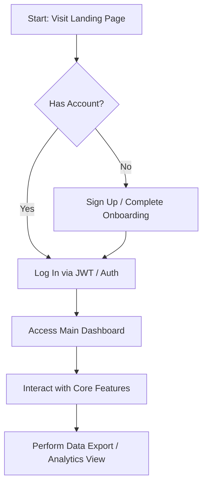

# Product Requirements Document (PRD)

**Project:**  Aplikasi Manajemen Tool
**Platform:** API / Backend
**Generated Date:** 2026-06-05 

---

## 1. Overview
This PRD describes the vision, objectives, and specifications for ** Aplikasi Manajemen Tool**, a specialized API / Backend platform designed for Individual Consumer. The primary mission is to deliver a seamless, high-performance solution solving key friction points around:
- Workflow fragmentation and slow user response times.
- Seamless data capture and storage.
- Real-time visualization and analytics of critical user activities.

## 2. Requirements
The system must satisfy both functional and non-functional goals to ensure success.

### Functional Requirements
- **FR-1:** Users must be able to securely register, log in, and manage their system profiles.
- **FR-2:** The application must support core operations on features like: Baik Bagi Penjual Maupun Pembeli Sistem Membantu Pengelolaan Data Hewan, Transaksi Penjualan, Laporan Keuangan, Serta Pemantauan Pengiriman Secara Terintegrasi## Fitur Untuk Penjual### 1 Manajemen Data Hewan KurbanPenjual Dapat Menambahkan Data Hewan Kurban Seperti:* Jenis Hewan (Sapi, Kambing.
- **FR-3:** Data export capabilities (CSV, JSON) must be accessible from the main dashboard.

### Non-Functional Requirements
- **Performance:** Interface response times must be under 300ms.
- **Scalability:** Architecture must support up to 50,000 active users concurrently.
- **Availability:** Target service availability is 99.9% uptime.

## 3. Core Features
Here is the detailed specification of the main features:

### 3.1 Baik Bagi Penjual Maupun Pembeli Sistem Membantu Pengelolaan Data Hewan
Detailed specification for Baik Bagi Penjual Maupun Pembeli Sistem Membantu Pengelolaan Data Hewan:
- **Description:** Allows target users to interact with Baik Bagi Penjual Maupun Pembeli Sistem Membantu Pengelolaan Data Hewan directly from their dashboard.
- **Inputs:** User interaction inputs, structured text/files.
- **Outputs:** Real-time updates, confirmation visual toasts, persisted databases record.
- **Priority:** High (P0)

### 3.2 Transaksi Penjualan
Detailed specification for Transaksi Penjualan:
- **Description:** Allows target users to interact with Transaksi Penjualan directly from their dashboard.
- **Inputs:** User interaction inputs, structured text/files.
- **Outputs:** Real-time updates, confirmation visual toasts, persisted databases record.
- **Priority:** High (P0)

### 3.3 Laporan Keuangan
Detailed specification for Laporan Keuangan:
- **Description:** Allows target users to interact with Laporan Keuangan directly from their dashboard.
- **Inputs:** User interaction inputs, structured text/files.
- **Outputs:** Real-time updates, confirmation visual toasts, persisted databases record.
- **Priority:** High (P0)

### 3.4 Serta Pemantauan Pengiriman Secara Terintegrasi## Fitur Untuk Penjual### 1 Manajemen Data Hewan KurbanPenjual Dapat Menambahkan Data Hewan Kurban Seperti:* Jenis Hewan (Sapi
Detailed specification for Serta Pemantauan Pengiriman Secara Terintegrasi## Fitur Untuk Penjual### 1 Manajemen Data Hewan KurbanPenjual Dapat Menambahkan Data Hewan Kurban Seperti:* Jenis Hewan (Sapi:
- **Description:** Allows target users to interact with Serta Pemantauan Pengiriman Secara Terintegrasi## Fitur Untuk Penjual### 1 Manajemen Data Hewan KurbanPenjual Dapat Menambahkan Data Hewan Kurban Seperti:* Jenis Hewan (Sapi directly from their dashboard.
- **Inputs:** User interaction inputs, structured text/files.
- **Outputs:** Real-time updates, confirmation visual toasts, persisted databases record.
- **Priority:** High (P0)

### 3.5 Kambing
Detailed specification for Kambing:
- **Description:** Allows target users to interact with Kambing directly from their dashboard.
- **Inputs:** User interaction inputs, structured text/files.
- **Outputs:** Real-time updates, confirmation visual toasts, persisted databases record.
- **Priority:** High (P0)


## 4. User Flow
The primary user flows through the system as follows:



## 5. Architecture
A modern multi-layered cloud architecture is employed:
- **Client Web/Mobile App:** Built using modern components and reactive rendering patterns.
- **Backend API Gateway:** Exposes RESTful endpoints, handles rate limiting, and performs authentication validation.
- **Database & Cache Layer:** SQLite/PostgreSQL for relational persistence and Redis for session cache management.

## 6. Database Schema
Below is the relational layout representing the main application models:

```sql
-- Users Table
CREATE TABLE users (
    id UUID PRIMARY KEY,
    name VARCHAR(255) NOT NULL,
    email VARCHAR(255) UNIQUE NOT NULL,
    created_at TIMESTAMP DEFAULT CURRENT_TIMESTAMP
);

-- Core Resources Table
CREATE TABLE resources (
    id UUID PRIMARY KEY,
    user_id UUID REFERENCES users(id) ON DELETE CASCADE,
    title VARCHAR(255) NOT NULL,
    content TEXT,
    updated_at TIMESTAMP DEFAULT CURRENT_TIMESTAMP
);
```

## 7. Design & Technical Constraints
- **Database Constraints:** Relational constraint enforcement must be handled at the database layer (SQLite foreign keys enabled).
- **Design Guidelines:** Dark Mode UI prioritizing accessibility and fast screen transitions (under 150ms).
- **Security Protocols:** All client-server payloads must be encrypted via HTTPS/TLS 1.3.

---
*Generated by PRD AI platform on 6/6/2026*
